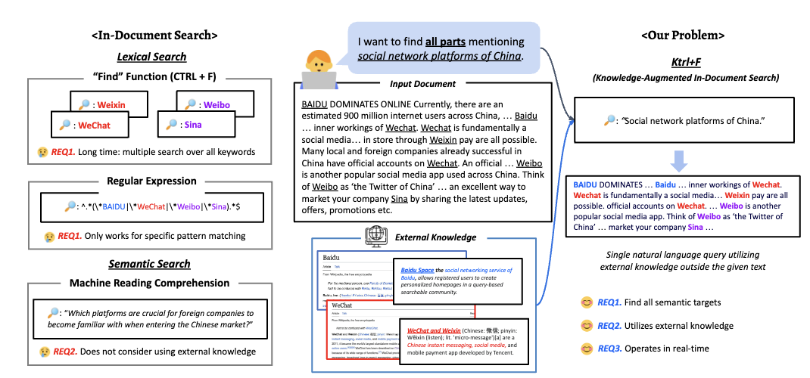

# KTRL+F: Knowledge-Augmented In-Document Search
Official repository for ["KTRL+F: Knowledge-Augmented In-Document Search"](https://arxiv.org/abs/2311.08329)

We introduce a new problem KTRL+F, a knowledge-augmented in-document search task that necessitates real-time identification of all semantic targets within a document with the awareness of external sources through a single natural query. This task addresses following unique challenges for in-document search: 1) utilizing knowledge outside the document for extended use of additional information about targets to bridge the semantic gap between the query and the targets, and 2) balancing between real-time applicability with the performance.


<p align="center">
  
</p>


## Ktrl+F Dataset Construction Pipeline
In the absence of suitable benchmarks for evaluating the KTRL+F, we introduce a data construction pipeline that aims to collect sets of key components for KTRL+F: **_input document_**, **_query_**, **_corresponding targets_**, and **_external knowledge_**.
Full pipeline codes are under [ktrlf_dataset_pipeline](ktrlf_dataset_pipeline). 

The dataset is available under [ktrlf_dataset_pipeline/ktrlf_dataset](ktrlf_dataset_pipeline/ktrlf_dataset).


## Ktrl+F plugin 
We release Chrome Extension Plugin built on our model under [ktrlf_plugin](ktrlf_plugin) folder. 


## Citation
Please cite if you use the data or code in this repo.

```
@inproceedings{oh2024ktlrf,
  title={KTRL+F: Knowledge-Augmented In-Document Search},
  author={Oh, Hanseok and Shin, Haebin and Ko, Miyoung and Lee, Hyunji and Seo, Minjoon},
  booktitle={NAACL},
  year={2024}
}
```
